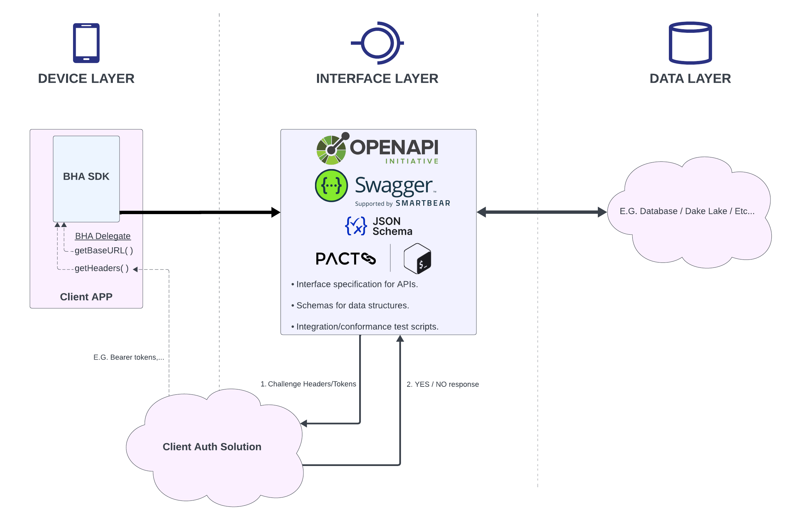
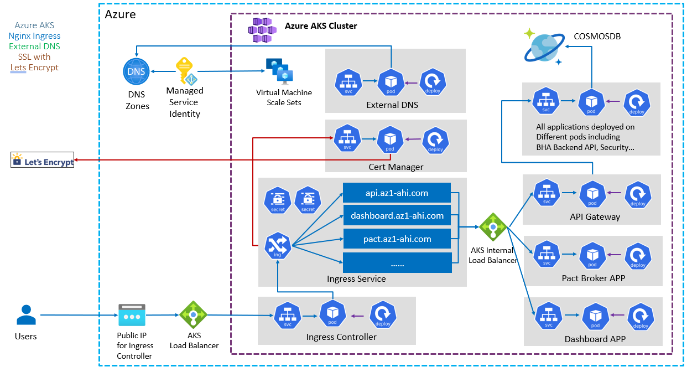
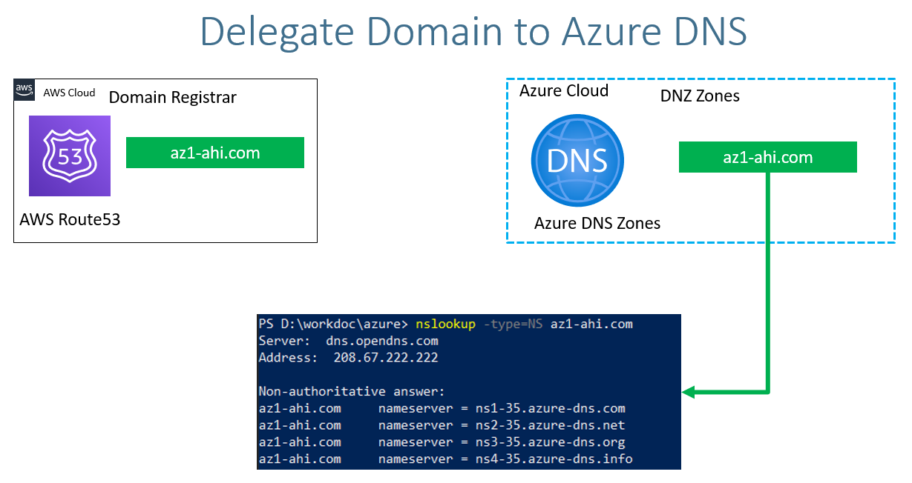

# AHI Cloud - BHA Data Reference

Azure reference implementation of the AHI Biometric Health Assessment (BHA) Data Service specification.

## HOW-TO: Deploy

AHI recommend using [Terraform Cloud](https://www.terraform.io/cloud) to deploy and manage AHI Cloud deployment. This how-to details what is needed to deploy to a fresh Azure account. To configure Terraform Cloud with Azure, it is recommended to use a [Service Principal](https://learn.microsoft.com/en-us/azure/developer/terraform/authenticate-to-azure?tabs=bash#create-a-service-principal).

## Overview

Per the AHI BHA Data Service specification, this reference implementation complies with the specification to provide a working solution that the AHI BHA SDK can utilize. A client may base their implementation on this reference implementation or use as-is. AHI will continue to enhance and maintain this reference implementation, however AHI will at best offer consultation with any client implementations with respect to the specification, or custom deployments.

The BHA Data Service specification consists of three layers:
1. Device Layer - where the client application runs with the AHI BHA SDK integrated into.
2. Interface Layer - where the service APIs are hosted. APIs comply with the specification accordingly.
3. Data Layer - How the data is stored. This reference implementation uses [Azure CosmosDB](https://azure.microsoft.com/en-au/products/cosmos-db).



<br>
<br>

---
# **Interface Layer**

<br>
Interface layer provides a sample implementation of the BHA Backend APIs, which is deployed in a microservice architecture running on Azure Kubernetes.
This terraform script can help you to build a complete microservcice environment and deploy the 'Interface layer' on it.

If you already have had a Kubernetes clusters on Azure, GCP, AWS and so on, you can use the repository below to deploy your own 'Interfrace Layer' directly, <br/>
https://github.com/ahi-lab/ahi-bha-microservice-deployment

## Interface Layer - Kubernetes Deployment Architeture


## Before You Start
1. Create SSH Keys for AKS Linux VMs Login **You can use the existing SSHKEYs in this project, but highly recommend you create your own for SECURITY**<br>
   Refer to document: /aks-sshkeys/readme.md
2. Add Public DNS Zone in resource group 'dns-zone' using Azure Portal (e.g. az1-ahi.com). Make corresponding changes in your domain provider for the name servers that are used in newly created DNS Zone  <br>
   Refer to document: <br>
   https://learn.microsoft.com/en-us/azure/dns/dns-getstarted-portal <br>
   https://docs.aws.amazon.com/Route53/latest/DeveloperGuide/migrate-dns-domain-in-use.html <br>
   If you are using AWS Route53 as your Domain Provider, the mechanism looks like below,
   

3. If you are running the terraform script locally instead of in a Terraform Workspace, you can use Azure Storage Blob to handle the the deployment state.<br>
   Please ensure if the storage has been configured or not.
    ```
      # Terraform State Storage to Azure Storage Container
      backend "azurerm" {
        resource_group_name = "terraform-storage-rg"
        storage_account_name = "terraformstateahienv"
        container_name = "tfstatefiles"
        key = "terraform-cloud-infra-bha.tfstate"
      }
      ```
4. The scrips run on Terraform Cloud, you need to create an Azure **Service Principal** which has privileges below so that Terraform cloud can use it to create all the resources for you,
- Role: Cloud Application Administrator <br>
            Default Directory -> Roles and Administrators  -> 'Cloud Application Administrator'
- Role: Groups Administrator <br>
            Default Directory -> Roles and Administrators  -> 'Groups Administror'
- IAM Role: Privileged administrator roles <br>
            Subscription -> Access Control (IAM) -> Add -> Add Role Assignment -> Privileged administrator roles (TAB) -> 'Role Based Access Control Administrator'

5. Change the value of the viariables below to create the enviornment (client_id and client_secret belong to the newly created **Service Principal**)
- subscription_id
- tenant_id
- client_id
- client_secret
- az_dns_zone_name


## Deployed components on Azure
1. AKS cluster
   - VNet
   - Subnet
   - Ingress Public IP Address
   - Service Provider   
   - Analytics Workspace
   - AKS Default Node Pool

2. Basic components in AKS cluster
   - storage
   - cert-manager
   - external-dns
   - ingress-nginx
   - dashboard
   - prometheus-grafana
   - pact-broker   

3. BHA Microsercices in AKS cluster
   - bha-backend-api
   - apigw
   - eureka
   - pact-broker

<br>

## Connect to cluster
The command below is an output of the Terraform script, so once you run Terraform project successfully, you can see the command below,
```
az aks get-credentials -g your-resource-group-name -n your-aks-cluster-name --overwrite-existing --admin
```
<br>

## Kubernetes Dashboard
   - Get Kubernetes Dashboard Access Token:
   The command below is an output of the Terraform script, so once you run Terraform project successfully, you can see the command below,
   ```
      kubectl describe secret aks-admin-token -n kube-system
   ```
   - Dashboard URL<br>
    <https://your-dashboard-host-prefix.your-dns-zone/dashboard>


## Links of Internal AKS Cluster
### API
<https://your-api-host-prefix.your-dns-zone> <br>
**e.g.** https://api-uat.az1-ahi-int.com
### API Specifications
<https://your-api-host-prefix.your-dns-zone/swagger-ui.html> <br>
**e.g.** https://api-uat.az1-ahi-int.com/swagger-ui.html <br>
<https://your-pact-host-prefix.your-dns-zone/><br>
**e.g.** https://pact.az1-ahi-int.com <br>